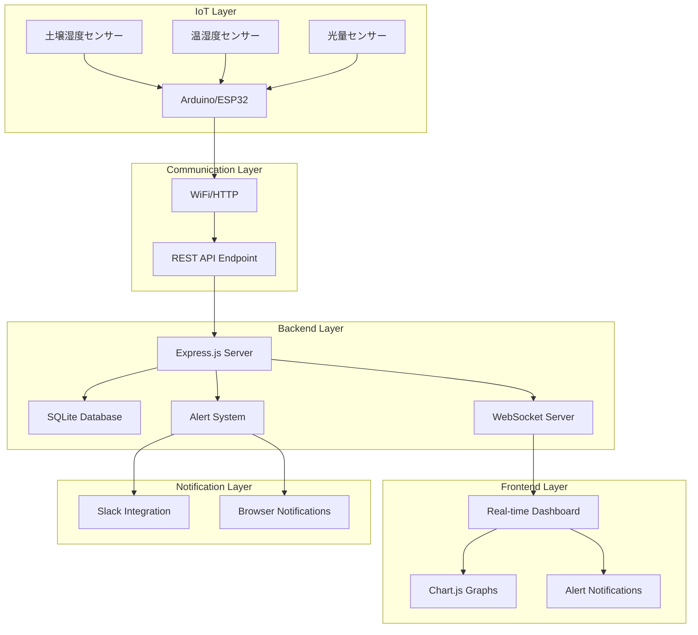

# Design Document

## Overview

植物の状態を監視するIoTシステムは、複数のセンサー（土壌湿度、温湿度、光量）からリアルタイムでデータを収集し、Webインターフェースを通じて植物の健康状態を監視できるシステムです。既存の植物管理システムを拡張し、IoTセンサーデータの収集・表示・アラート機能を追加します。

## Architecture

### System Architecture



### Data Flow

1. **センサーデータ収集**: Arduino/ESP32がセンサーからデータを読み取り
2. **データ送信**: HTTP POSTでサーバーにデータを送信
3. **データ保存**: SQLiteデータベースにタイムスタンプ付きで保存
4. **リアルタイム配信**: WebSocketで接続中のクライアントに配信
5. **アラート判定**: 閾値チェックとアラート送信
6. **データ表示**: Webインターフェースでグラフ表示

## Components and Interfaces

### 1. IoTデバイス側 (Arduino/ESP32)

**センサー構成:**
- DHT22: 温湿度センサー
- 土壌湿度センサー: アナログ出力
- LDR (Light Dependent Resistor): 光量センサー

**データ送信フォーマット:**
```json
{
  "device_id": "plant_monitor_01",
  "timestamp": "2024-01-15T10:30:00Z",
  "soil_moisture": 65.5,
  "temperature": 23.2,
  "humidity": 58.3,
  "light_level": 1250
}
```

### 2. Backend API

**新規エンドポイント:**
- `POST /api/sensor-data` - センサーデータ受信
- `GET /api/sensor-data/:plant_id` - 植物の最新センサーデータ取得
- `GET /api/sensor-data/:plant_id/history` - 履歴データ取得
- `POST /api/plants/:id/thresholds` - アラート閾値設定
- `GET /api/plants/:id/thresholds` - 閾値設定取得

**WebSocket Events:**
- `sensor_data_update` - リアルタイムセンサーデータ
- `alert_triggered` - アラート発生通知
- `device_status` - デバイス接続状態

### 3. Frontend Components

**新規UI要素:**
- リアルタイムセンサーダッシュボード
- 時系列グラフ（Chart.js使用）
- アラート設定パネル
- デバイス状態インジケーター

## Data Models

### 1. sensor_data テーブル

```sql
CREATE TABLE sensor_data (
  id INTEGER PRIMARY KEY AUTOINCREMENT,
  plant_id INTEGER,
  device_id TEXT NOT NULL,
  soil_moisture REAL,
  temperature REAL,
  humidity REAL,
  light_level REAL,
  recorded_at DATETIME DEFAULT CURRENT_TIMESTAMP,
  FOREIGN KEY (plant_id) REFERENCES plants (id)
);
```

### 2. alert_thresholds テーブル

```sql
CREATE TABLE alert_thresholds (
  id INTEGER PRIMARY KEY AUTOINCREMENT,
  plant_id INTEGER,
  soil_moisture_min REAL DEFAULT 30,
  soil_moisture_max REAL DEFAULT 80,
  temperature_min REAL DEFAULT 18,
  temperature_max REAL DEFAULT 28,
  humidity_min REAL DEFAULT 40,
  humidity_max REAL DEFAULT 70,
  light_level_min REAL DEFAULT 500,
  created_at DATETIME DEFAULT CURRENT_TIMESTAMP,
  updated_at DATETIME DEFAULT CURRENT_TIMESTAMP,
  FOREIGN KEY (plant_id) REFERENCES plants (id)
);
```

### 3. device_status テーブル

```sql
CREATE TABLE device_status (
  id INTEGER PRIMARY KEY AUTOINCREMENT,
  device_id TEXT UNIQUE NOT NULL,
  plant_id INTEGER,
  is_online BOOLEAN DEFAULT 1,
  last_seen DATETIME DEFAULT CURRENT_TIMESTAMP,
  battery_level REAL,
  FOREIGN KEY (plant_id) REFERENCES plants (id)
);
```

### 4. alerts テーブル

```sql
CREATE TABLE alerts (
  id INTEGER PRIMARY KEY AUTOINCREMENT,
  plant_id INTEGER,
  alert_type TEXT NOT NULL,
  message TEXT NOT NULL,
  severity TEXT DEFAULT 'warning',
  is_resolved BOOLEAN DEFAULT 0,
  created_at DATETIME DEFAULT CURRENT_TIMESTAMP,
  resolved_at DATETIME,
  FOREIGN KEY (plant_id) REFERENCES plants (id)
);
```

## Error Handling

### 1. センサーデータ受信エラー

- **無効なデータフォーマット**: バリデーションエラーレスポンス
- **デバイス認証失敗**: 401 Unauthorized
- **データベース保存失敗**: 500 Internal Server Error + ログ記録

### 2. WebSocket接続エラー

- **接続失敗**: 自動再接続機能（指数バックオフ）
- **データ送信失敗**: エラーログ記録とフォールバック

### 3. アラートシステムエラー

- **Slack通知失敗**: ログ記録とブラウザ通知へフォールバック
- **閾値設定エラー**: デフォルト値使用

### 4. デバイス接続監視

- **オフライン検出**: 5分間データ受信なしでオフライン判定
- **バッテリー低下**: 20%以下でアラート送信

## Testing Strategy

### 1. Unit Tests

**Backend:**
- センサーデータバリデーション
- アラート判定ロジック
- データベース操作
- WebSocket通信

**Frontend:**
- グラフ描画コンポーネント
- リアルタイムデータ更新
- アラート表示

### 2. Integration Tests

- センサーデータ受信からWebSocket配信まで
- アラート発生からSlack通知まで
- デバイス状態監視機能

### 3. IoTデバイステスト

- センサー読み取り精度
- WiFi接続安定性
- データ送信頻度とバッテリー消費

### 4. Performance Tests

- 複数デバイス同時接続
- 大量データ処理
- WebSocket接続数制限

## Security Considerations

### 1. デバイス認証

- デバイスIDとAPIキーによる認証
- HTTPS通信の強制
- レート制限の実装

### 2. データ保護

- センサーデータの暗号化保存
- アクセスログの記録
- 不正アクセス検出

### 3. WebSocket Security

- Origin検証
- 認証済みユーザーのみ接続許可
- メッセージサイズ制限

## Performance Optimization

### 1. データベース最適化

- センサーデータテーブルのインデックス作成
- 古いデータの自動削除（1年以上）
- クエリ最適化

### 2. リアルタイム通信最適化

- WebSocket接続プール管理
- データ圧縮
- 差分更新の実装

### 3. フロントエンド最適化

- グラフデータのキャッシュ
- 仮想スクロール（大量データ表示時）
- レスポンシブデザイン

## Deployment Considerations

### 1. 環境設定

- IoTデバイス設定ファイル
- WiFi認証情報管理
- サーバー環境変数

### 2. 監視とログ

- システムヘルスチェック
- エラーログ集約
- パフォーマンス監視

### 3. バックアップ戦略

- センサーデータの定期バックアップ
- 設定情報のバックアップ
- 災害復旧計画